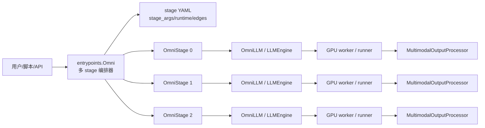
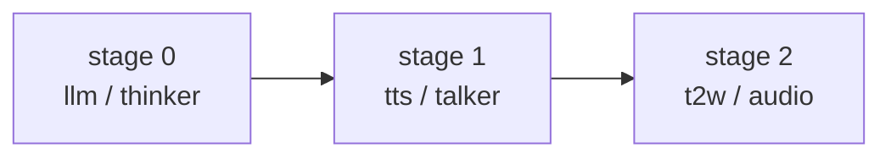
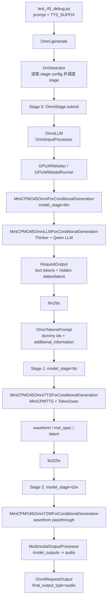
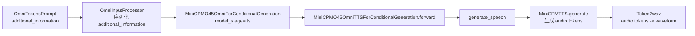

# vLLM-Omni 构成与 MiniCPM-o 4.5 数据流速览

这份笔记从仓库结构开始，快速建立对 vLLM-Omni 的整体认识，然后从 `test_45_debug.py` 出发，追踪 MiniCPM-o 4.5 在当前仓库里的适配方式，以及一次文本到语音请求会经过哪些模块。

## 1. vLLM-Omni 大致由什么组成

vLLM-Omni 是在 vLLM 的文本自回归推理能力上，扩展出多模态输入、多阶段流水线和异构输出的推理框架。它的核心不是“一个模型类包打天下”，而是用 stage config 把多个模型/子模型串成 pipeline。

常见目录可以这样理解：

| 位置 | 作用 |
| --- | --- |
| `vllm_omni/entrypoints/` | 对外入口和编排层，`Omni` 负责多 stage 调度，`OmniLLM` 包装 vLLM LLMEngine，OpenAI API 也在这里。 |
| `vllm_omni/config/` | Omni 自己的配置封装，尤其是 `OmniModelConfig` 和 stage YAML 解析。 |
| `vllm_omni/engine/` | 输入/输出处理器，负责把 Omni 特有的 `additional_information`、`prompt_embeds`、多模态输出接入 vLLM 引擎。 |
| `vllm_omni/worker/` | GPU runner/worker，负责真正执行模型，并把 hidden states、audio/image/latent 等作为 `pooler_output` 带回。 |
| `vllm_omni/model_executor/` | 模型注册、模型实现、stage input processor、stage config。MiniCPM-o 4.5 的适配主要在这里。 |
| `vllm_omni/distributed/omni_connectors/` | stage 之间的数据传输抽象，例如 shared memory connector。 |
| `vllm_omni/inputs/` | Omni prompt 类型扩展，例如 `OmniTokensPrompt` 支持携带 `additional_information`。 |
| `vllm_omni/outputs.py` | `OmniRequestOutput`，统一封装 pipeline stage 或 diffusion stage 的最终输出。 |
| `examples/`、`docs/`、`test/` | 示例、文档和测试配置。 |

整体运行模型可以简化为：



## 2. 从 `test_45_debug.py` 看入口

`test_45_debug.py` 做了三件事：

1. 构造 `Omni`：

```python
omni = Omni(
    model="/cache/hanqingzhe/o45-pure-py",
    stage_configs_path="vllm_omni/model_executor/stage_configs/minicpmo45_8x4090.yaml",
    trust_remote_code=True,
)
```

2. 拼一个 MiniCPM-o 风格的 chat prompt，并在 assistant 开头追加 TTS 标记：

```python
TTS_SUFFIX = "<|spk_bos|><|spk|><|spk_eos|><|tts_bos|>"
prompt = (
    "<|im_start|>system\nYou are a helpful assistant.<|im_end|>\n"
    "<|im_start|>user\n你好<|im_end|>\n"
    "<|im_start|>assistant\n" + TTS_SUFFIX
)
```

3. 调用 `omni.generate(prompt)`，然后打印每个最终输出里的 `stage_id`、`final_output_type`、文本和 `multimodal_output`。

这里的关键点是：`generate` 不是只跑一个模型，而是根据 `minicpmo45_8x4090.yaml` 跑三段 pipeline。

## 3. MiniCPM-o 4.5 的 stage 配置

`vllm_omni/model_executor/stage_configs/minicpmo45_8x4090.yaml` 定义了 3 个 stage：

| stage | `model_stage` | 模型架构 | 输入来源 | 输出类型 | 作用 |
| --- | --- | --- | --- | --- | --- |
| 0 | `llm` | `MiniCPMO45OmniForConditionalGeneration` | 原始 prompt | `latent`，同时标记 text final | Thinker/LLM：生成文本 token，并返回 hidden states。 |
| 1 | `tts` | `MiniCPMO45OmniForConditionalGeneration` | stage 0 | `latent` | Talker：从 LLM 的 TTS token 与 hidden states 生成语音波形。 |
| 2 | `t2w` | `MiniCPMO45OmniForConditionalGeneration` | stage 1 | `audio` | Code2Wav/透传：把 stage 1 的 waveform 作为最终 audio 输出。 |

两个自定义 stage input processor 负责跨 stage 改写输入：

| 边 | 函数 | 作用 |
| --- | --- | --- |
| stage 0 -> stage 1 | `stage_input_processors.minicpmo_4_5_omni.llm2tts` | 从 LLM 输出中抽取 hidden states、prompt token、生成 token、TTS 区间 token 和 hidden states，封装进 `additional_information`。 |
| stage 1 -> stage 2 | `stage_input_processors.minicpmo_4_5_omni.tts2t2w` | 从 Talker 输出的 `mel_spec` / `latent` / waveform 中恢复音频张量，封装给 t2w stage。 |

配置里的 `runtime.edges` 是：



## 4. MiniCPM-o 4.5 是怎么注册和分发到子模型的

MiniCPM-o 4.5 的模型注册在 `vllm_omni/model_executor/models/registry.py`：

| registry key | 实际类 |
| --- | --- |
| `MiniCPMO45OmniForConditionalGeneration` | `minicpmo_4_5_omni.MiniCPMO45OmniForConditionalGeneration` |
| `MiniCPMO45OmniLLMModel` | `minicpmo_4_5_omni_llm.MiniCPMO45OmniLLMForConditionalGeneration` |
| `MiniCPMO45OmniTTSModel` | `minicpmo_4_5_omni_tts.MiniCPMO45OmniTTSForConditionalGeneration` |
| `MiniCPMO45OmniT2WModel` | `minicpmo_4_5_omni_t2w.MiniCPMO45OmniT2WForConditionalGeneration` |

YAML 中三个 stage 都声明外层架构 `MiniCPMO45OmniForConditionalGeneration`。这个外层类在初始化时读取 `model_stage`，再选择真正的子模型：

| `model_stage` | 外层类内部初始化 |
| --- | --- |
| `llm` | `self.thinker = MiniCPMO45OmniLLMModel` |
| `tts` | `self.talker = MiniCPMO45OmniTTSModel` |
| `t2w` | `self.code2wav = MiniCPMO45OmniT2WModel` |

也就是说，MiniCPM-o 4.5 的适配方式是“同一个外层架构 + 不同 stage 参数 + 不同子模型实现”。

## 5. 端到端数据流

下面这张图对应 `test_45_debug.py` 的一次 `omni.generate(prompt)`：



### 5.1 Stage 0：Thinker/LLM

Stage 0 的输入就是 `test_45_debug.py` 里的字符串 prompt。它会经过：

1. `Omni.generate` 把请求放入 stage 0 队列。
2. `OmniStage` worker 收到任务后调用 `OmniLLM.generate`。
3. `OmniLLM` 使用 `OmniInputProcessor` 做 tokenization 和多模态预处理。
4. `GPUARModelRunner` 执行模型，并把 hidden states 作为 `pooler_output` 的一部分带回。
5. `MiniCPMO45OmniForConditionalGeneration(model_stage="llm")` 调用内部 `thinker`。

`thinker` 即 `MiniCPMO45OmniLLMForConditionalGeneration`，它包含：

| 模块 | 作用 |
| --- | --- |
| `MiniCPMVImageProcessor` | 图片切片和占位符处理。当前 debug prompt 是纯文本，所以不会真的走图像数据。 |
| `SiglipVisionTransformer` + `Resampler` | 图像/视频 embedding 到 LLM embedding 的转换路径。 |
| `MiniCPMWhisperEncoder` + `audio_projection_layer` | 音频输入编码路径。 |
| `Qwen2ForCausalLM` 或 `Qwen3ForCausalLM` | 文本主干 LLM。 |

对这个 debug 脚本而言，关键输出是：

| 字段 | 含义 |
| --- | --- |
| `outputs[0].text` | LLM 生成的文本。 |
| `outputs[0].token_ids` | LLM 生成 token。 |
| `prompt_token_ids` | prompt token，包括 `<|spk_bos|>`、`<|spk|>`、`<|spk_eos|>`、`<|tts_bos|>`。 |
| `outputs[0].multimodal_output["latent"]` | LLM hidden states，供 TTS stage 做语义条件。 |

### 5.2 Stage 0 -> Stage 1：`llm2tts`

`llm2tts` 是 MiniCPM-o 4.5 适配里很关键的一段 glue code。它读取 stage 0 的 `engine_outputs`，然后构造 stage 1 的 `OmniTokensPrompt`。

它主要做这些事：

1. 取出 `llm_output.outputs[0]`。
2. 读取 `prompt_token_ids` 和 LLM 生成的 `token_ids`。
3. 从 `multimodal_output["latent"]` 或 `hidden_states` 中得到 `thinker_hidden_states`。
4. 将 hidden states 分成 prompt 部分和生成部分。
5. 在完整 token 序列里定位 TTS 区间：
   - 4.5 优先识别 `151703` / `151704`。
   - 兼容 2.6 的 `151691` / `151692`。
6. 把 TTS 区间的 token 和 hidden states 放入 `additional_information`：

| key | 内容 |
| --- | --- |
| `prompt_embeds` | prompt 部分 hidden states，主要用于 speaker 相关信息。 |
| `prompt_token_ids` | 原始 prompt token。 |
| `llm_output_token_ids` | LLM 生成 token。 |
| `llm_output_text` | LLM 输出文本。 |
| `tts_token_ids` | `<|tts_bos|>` 之后、`<|tts_eos|>` 之前的文本 token。 |
| `tts_hidden_states` | 与 `tts_token_ids` 对齐的 hidden states。 |

真正送给 stage 1 的 prompt token 是 `[1, 0, 2]`，它只是为了让 AR 框架完成一次最小 prefill；真正有用的数据在 `additional_information`。

### 5.3 Stage 1：Talker/TTS

Stage 1 仍然通过 `OmniLLM` 和 `GPUARWorker` 执行，但外层模型的 `model_stage` 是 `tts`。

调用链是：



`MiniCPMO45OmniTTSForConditionalGeneration` 的核心逻辑：

1. 懒加载模型目录里的 dynamic module：`modeling_minicpmo.MiniCPMTTS`。
2. 尝试加载 `assets/token2wav`，创建 `stepaudio2.Token2wav`。
3. 对 `tts_token_ids` 做 `emb_text`。
4. 对 `tts_hidden_states` 做 `projector_semantic`。
5. 把两者相加，形成 `hidden_text_merge` 条件。
6. 拼上 `text_eos` 和 `audio_bos`。
7. 调 `MiniCPMTTS.generate()` 得到离散 audio tokens。
8. 用 `Token2wav` 转成 waveform。

这里还有一个“流式”相关点：如果生成的 audio token 很长，`generate_speech` 会切到 Token2wav 的 streaming vocoder 路径，按 chunk 调 `audio_tokenizer.stream()`，最后把多个 waveform 片段拼起来。这个流式发生在 stage 1 内部，是为了控制长音频的显存峰值。

### 5.4 Stage 1 -> Stage 2：`tts2t2w`

Stage 1 的外层 wrapper 会把 Talker 结果包装进 `OmniOutput.multimodal_outputs`。当前 4.5 Talker 实际已经产出了 waveform，但变量名上仍可能叫 `mel_spec` / `latent`，所以 `tts2t2w` 做了比较宽松的恢复：

1. 先看 `output.multimodal_output["mel_spec"]`。
2. 再看 `output.multimodal_output["model_outputs"]`。
3. 再看 `output.multimodal_output["latent"]`。
4. 如果 `latent` 是一维且长度足够大，就把它当 waveform。
5. 构造新的 `OmniTokensPrompt`，仍然用 `[1, 0, 2]` 作为 dummy token，把 waveform 或 mel_spec 放进 `additional_information`。

### 5.5 Stage 2：T2W/Audio 输出

Stage 2 的 `model_stage` 是 `t2w`。从代码看，MiniCPM-o 4.5 的 Talker 已经做了 Token2wav，所以 stage 2 更像是一个输出规整/透传 stage：

| 输入 | 处理 |
| --- | --- |
| `additional_information["waveform"]` | 直接作为 `model_outputs` 返回。 |
| 一维 `mel_spec` | 也直接当 waveform 返回。 |
| 真正的 mel tensor | 才会尝试调用 `code2wav`。 |

`MiniCPMO45OmniT2WForConditionalGeneration` 本身也是 no-op passthrough：拿到 waveform 后返回 `OmniOutput(multimodal_outputs={"model_outputs": [waveform]})`。

最后 `MultimodalOutputProcessor` 根据 stage 2 的 `engine_output_type: audio`，把 `model_outputs` 归一化成 `audio` key。于是 `test_45_debug.py` 里：

```python
out.multimodal_output
```

通常会拿到类似：

```python
{"audio": <torch.Tensor 或 list/tensor>}
```

## 6. 数据在各层的形态变化

| 位置 | 数据形态 |
| --- | --- |
| `test_45_debug.py` | Python 字符串 prompt，包含 chat template 和 TTS special tokens。 |
| Stage 0 输入 | vLLM prompt/token inputs。 |
| Stage 0 模型输出 | 文本 token/text + hidden states，hidden states 作为 `latent` 多模态输出。 |
| `llm2tts` 后 | `OmniTokensPrompt(prompt_token_ids=[1,0,2], additional_information={...})`。 |
| Stage 1 模型输入 | dummy token 触发 AR 框架，真实 TTS 条件从 `runtime_additional_information` 传入模型。 |
| Stage 1 模型输出 | waveform，包装成 `mel_spec` / `model_outputs` / `latent` 一类多模态输出。 |
| `tts2t2w` 后 | `OmniTokensPrompt(prompt_token_ids=[1,0,2], additional_information={"waveform": ...})` 或 `{"mel_spec": ...}`。 |
| Stage 2 模型输出 | `model_outputs`，由输出处理器标记为 `audio`。 |
| `Omni.generate` 返回 | `OmniRequestOutput(stage_id=2, final_output_type="audio", request_output=[...])`。 |

## 7. “流式”在这里有两层含义

第一层是 vLLM-Omni 的 pipeline 流水：`Omni` 不把所有 stage 写死在一个 forward 里，而是用 `OmniStage`、队列、connector 和 `runtime.edges` 把 stage 串起来。每个 stage 可以独立占用设备、独立 batch、独立输出，再由 orchestrator 转发到下一段。

第二层是音频 vocoder 内部的 chunk/stream：MiniCPM-o 4.5 的 `generate_speech` 在 audio token 数超过阈值时，使用 `Token2wav.set_stream_cache()` 和 `Token2wav.stream()` 分块合成 waveform，避免长音频一次性 vocoder 带来的显存爆炸。

注意：`test_45_debug.py` 调的是 `omni.generate(prompt)`，默认返回 list，不是 Python generator；如果要看 orchestrator 逐个 final output yield 的行为，可以关注 `Omni.generate(..., py_generator=True)`。

## 8. 调试时最值得看的文件

| 文件 | 看什么 |
| --- | --- |
| `test_45_debug.py` | 最小复现入口、模型路径、stage config 路径、TTS prompt。 |
| `vllm_omni/model_executor/stage_configs/minicpmo45_8x4090.yaml` | 三段 stage、设备、采样参数、input processor、输出类型。 |
| `vllm_omni/entrypoints/omni.py` | 多 stage 调度、stage 结果收集、final output 封装、转发下一 stage。 |
| `vllm_omni/entrypoints/omni_stage.py` | 单个 stage 的 worker、batch、调用 `OmniLLM.generate`、输出回传。 |
| `vllm_omni/entrypoints/omni_llm.py` | Omni 版 LLMEngine，替换 `OmniInputProcessor` 和 `MultimodalOutputProcessor`。 |
| `vllm_omni/engine/input_processor.py` | `additional_information` 如何序列化进 `OmniEngineCoreRequest`。 |
| `vllm_omni/engine/output_processor.py` | `pooling_output` 如何累积到 `CompletionOutput.multimodal_output`。 |
| `vllm_omni/worker/gpu_ar_model_runner.py` | hidden states 和 `multimodal_outputs` 如何变成 `pooler_output`。 |
| `vllm_omni/model_executor/models/registry.py` | MiniCPM-o 4.5 架构名到类的注册。 |
| `vllm_omni/model_executor/models/minicpmo_4_5/minicpmo_4_5_omni.py` | 外层 wrapper，按 `model_stage` 分发到 llm/tts/t2w。 |
| `vllm_omni/model_executor/models/minicpmo_4_5/minicpmo_4_5_omni_llm.py` | Thinker/LLM，多模态 processor、vision/audio encoder、Qwen 主干。 |
| `vllm_omni/model_executor/models/minicpmo_4_5/minicpmo_4_5_omni_tts.py` | Talker，`MiniCPMTTS.generate` 和 Token2wav。 |
| `vllm_omni/model_executor/models/minicpmo_4_5/minicpmo_4_5_omni_t2w.py` | t2w 透传逻辑。 |
| `vllm_omni/model_executor/stage_input_processors/minicpmo_4_5_omni.py` | `llm2tts` 和 `tts2t2w`，也就是跨 stage 数据流最核心的 glue code。 |

## 9. 一句话总结

`test_45_debug.py` 跑的是 MiniCPM-o 4.5 的三段式 TTS pipeline：stage 0 让 LLM 生成文本并吐出 hidden states，`llm2tts` 把 TTS 区间 token 和 hidden states 变成 Talker 条件，stage 1 生成 waveform，`tts2t2w` 再把 waveform 交给 stage 2，stage 2 把它规整成最终 `audio` 多模态输出。
